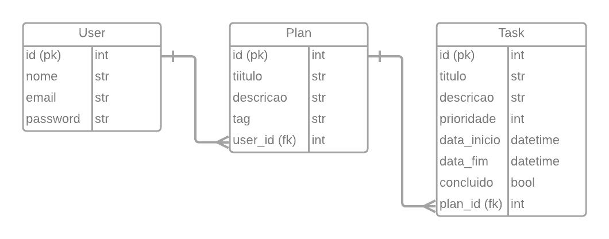

# fastAPI_sample 📝✔

Nesse repositório estou criando API para um 'To Do List', utilizando [FastAPI](https://fastapi.tiangolo.com/), [SQLAlchemy](https://www.sqlalchemy.org/), [Pydantic](https://pydantic-docs.helpmanual.io/), [Uvicorn](https://www.uvicorn.org/) e outras bibliotecas legais, com banco de dados SQLite 😁

## ERD



## Getting Started

> Utilize Python 3.8 ou superior.

1. Instalando o gerenciador de pacote e, posteriormente, ativá-lo na pasta onde está o projeto:

    ```bash
    pip install poetry
    ```

    ```bash
    poetry shell
    ```

    ```bash
    poetry update
    ```

2. Subir o WSGI (Web Server Gateway Interface):

    ```bash
    uvicorn main:app --port 8081
    ```

3. Agora podemos acessar a documentação da API no endereço:

    [http://localhost:8081/docs](http://localhost:8000/docs)
